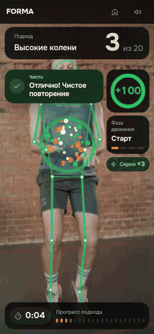
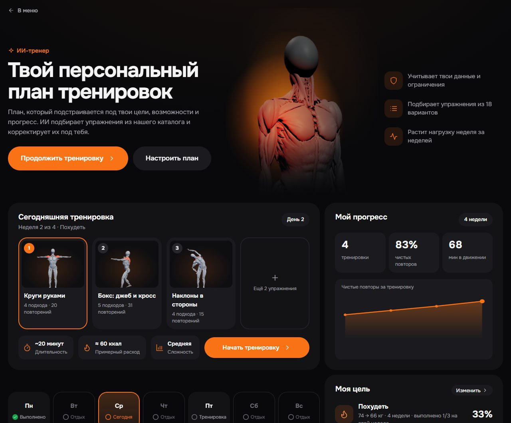
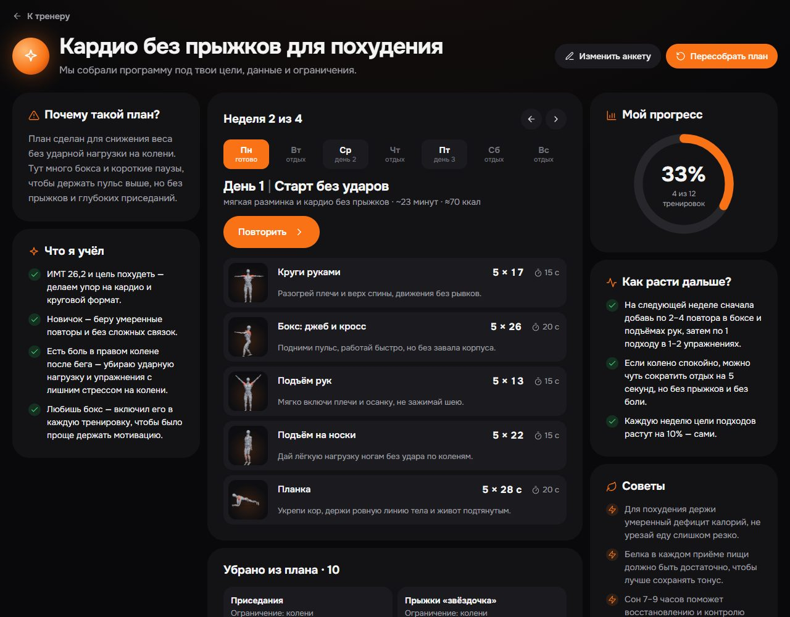

# FORMA — фитнес-тренер через веб-камеру

**Сайт:** https://forma.178.88.115.213.sslip.io/ — ничего не нужно устанавливать.

Тренер в браузере, которым управляют только телом: он считает повторения, замечает ошибки техники и сразу
говорит, как их исправить. Кейс ADMIT Hackathon «Motion: камера вместо джойстика».

<p align="center">
  
</p>
<p align="center"><sub>Камера считает каждое повторение: чистое — «+100», серия растёт.</sub></p>

## Как запустить локально

Нужен Node.js 22 и браузер с веб-камерой (Chrome, Edge или Safari).

```bash
npm install
npm run dev    # приложение: http://localhost:5173
npm run api    # во втором терминале: аккаунты, рейтинг, онлайн-дуэли и ИИ-тренер
```

Для ИИ-тренера нужен ключ OpenAI: положи в `.env` строку `OPENAI_API_KEY=...` (файл не попадает в git,
ключ живёт только на сервере — в браузер не уходит).

- Тренироваться можно и без `npm run api` — не будут работать только аккаунты, рейтинг и дуэли с людьми.
- Камера работает на `localhost` или по HTTPS.
- Без камеры — кнопка «Демо без камеры» на главной.
- `npm test` — тесты.

## Как это работает

1. Открываешь сайт, разрешаешь камеру и отходишь на 2–3 метра.
2. Приложение проверяет, видно ли тебя целиком и хватает ли света, и подсказывает, что поправить.
3. Дальше всё управляется телом:
   - поднятая рука — курсор на экране, задержал его на кнопке — нажатие (на компьютере с мышью — после кнопки
     «Жесты» вверху, на телефоне — всегда);
   - обе руки над головой — «назад» (в меню, рейтинге, итогах). Подход заканчивается сам, когда сделаны
     все повторы или секунды.
4. Во время подхода поверх видео рисуется твой скелет, идёт счёт и оценка каждого повторения.
5. Если техника неправильная, приложение сразу подсказывает, как исправить: текстом на экране, голосом,
   подсветкой суставов и стрелкой, куда их двигать. Повтор с ошибкой не считается чистым.
6. После подхода — итоги: оценка каждого повторения, число чистых и самые частые ошибки с советом.

Видео с камеры никуда не отправляется — распознавание идёт прямо в браузере.

<p align="center">
  
  
</p>

## Что есть

- **ИИ-тренер:** персональный план тренировок под твою цель, тело и здоровье — подробнее ниже.
- **Тренировки:** быстрая тренировка, одно упражнение на выбор (19 упражнений, включая подтягивания на турнике), челлендж «60 секунд».
- **Режим «ошибка»:** конкретные подсказки по технике во время движения.
- **Демо без камеры:** можно посмотреть, как всё устроено, не вставая с места.
- **Аккаунты, рейтинг и прогресс:** в рейтинг идут только чистые повторения, есть личные рекорды и график.
- **Дуэли:**
  - онлайн с другом в реальном времени — выбираешь упражнение и время, зовёшь игрока из списка или по ссылке,
    каждое повторение сразу видно сопернику;
  - арена с кубками за победы;
  - бой с ботом.
- **Звук и голос**, работает и на телефоне.

<p align="center">
  
</p>
<p align="center"><sub>Онлайн-дуэль: два человека на разных устройствах, счёт у обоих — в реальном времени.</sub></p>

## Подтягивания: камера видит и человека, и турник

Подтягивания засчитываются, только если человек правда висит на турнике и поднимает тело — махи руками
стоя, прыжки и бёрпи не считаются. Камеру можно ставить лицом, спиной или сбоку.

- **Турник по пикселям.** Точки тела MediaPipe перекладину не видят, поэтому у кистей вырезается полоса
  кадра и в ней ищется длинная тонкая линия, отличная по яркости от фона (`src/engine/bar.ts`). Анфас и
  спиной без найденной перекладины счёт стоит, и звучит подсказка «Не вижу турник». Сбоку перекладина
  смотрит в камеру торцом — там турник подтверждает само движение.
- **Подтягивание — это подъём всего тела к хвату:** плечи сближаются с кистями _и_ сами поднимаются в кадре,
  кисти стоят на месте (их держит перекладина), а стопы поднимаются вместе с телом. Начать повтор можно
  только из виса — руки над головой на всю длину.
- **Режим «ошибка»:** «Подтянись выше — подбородок над перекладиной», «Опускайся до прямых рук», «Не
  раскачивайся», «Повисни на турнике».
- **Проверено на 9 реальных роликах** с ручной разметкой повторов (лицом, спиной, сбоку, в темноте и против
  света): в 8 счёт совпадает точно, и на 15 кадрах в секунду тоже; в ролике «0 раз», где человек дёргается, но
  не дотягивается, — ноль и подсказка «подтянись выше». В девятом ролик обрывается в верхней точке последнего
  подтягивания: повтор засчитывается, когда человек пошёл вниз, поэтому 7 из 8. На 30 записях других
  упражнений подтягивания не насчитываются ни разу.

## ИИ-тренер: персональный план тренировок

Рассказываешь о себе — ИИ собирает программу на 4 недели из наших 19 упражнений. Каждый день плана
запускается как обычная тренировка: камера считает повторы и поправляет технику.

1. **Цель:** похудеть, набрать мышечную массу, подтянуть тело, выносливость или здоровье и подвижность.
2. **Данные:** пол, возраст, рост, вес, желаемый вес, уровень подготовки, сколько тренировок в неделю и минут на
   каждую. ИМТ считается сразу.
3. **Ограничения:** галочки (нельзя прыгать, спина или грыжа, колени, кисти, плечи, работает одна рука или одна
   нога, сердце, баланс, беременность, не могу на пол) и свободный текст — «нет левой руки», «болит колено
   после бега».
4. **План:** тренировки по дням недели с подходами и отдыхом, «Почему такой план», что ИИ учёл, медицинские
   предупреждения, какие упражнения убраны и почему, как расти дальше и советы по питанию и сну.

**Безопасность — не на честном слове модели:**

- у каждого упражнения в каталоге размечена нагрузка: прыжки, глубокий присед, упор на руки, лёжа, нужны обе
  руки, баланс, высокий пульс. Отмеченные ограничения сервер применяет сам, до ИИ: запрещённые упражнения
  модель даже не видит;
- свободный текст разбирает ИИ (OpenAI, структурированный ответ по JSON-схеме) и убирает то, что может навредить,
  с объяснением;
- ответ модели сервер проверяет ещё раз: только разрешённые упражнения, повторы в разумных пределах, без
  повторов упражнения в одной тренировке. Длительность и калории считает сервер, а не модель.

**Дальше план живёт сам:** главная тренера показывает сегодняшнюю тренировку, календарь недели, прогресс и
цель. Каждую неделю цели подходов растут на 10%, пройденные дни отмечаются. Вошедшему в аккаунт план хранится на
сервере и открывается с любого устройства. План не заменяет врача — это написано на экране.

<p align="center">
  
  
</p>

## Заготовки и сторонние материалы

Весь код написан после старта хакатона (28.09, 07:00), заготовок нет. Сторонние материалы: модель распознавания
позы MediaPipe (Google, Apache 2.0), языковая модель OpenAI для ИИ-тренера, анатомическая 3D-модель [Z-Anatomy](https://github.com/Z-Anatomy/Models-of-human-anatomy)
(CC BY-SA 4.0, лицензия — `public/models/LICENSE.txt`), боец в боксе с ботом — на основе
[Microsoft Rocketbox](https://github.com/microsoft/Microsoft-Rocketbox) (MIT, `public/models/boxer-LICENSE.txt`;
экипировку и пропорции собирает `scripts/build-boxer.mjs`) и ролики с [Pexels](https://www.pexels.com/license/) в GIF выше.
