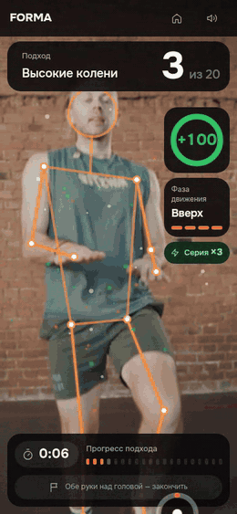
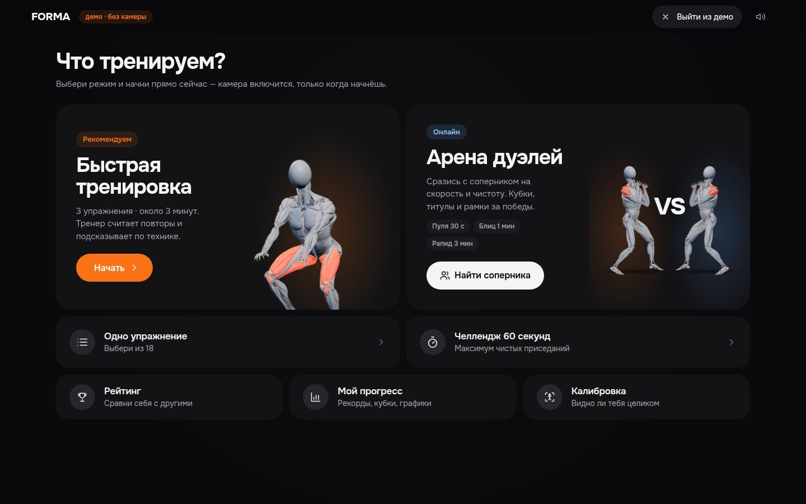
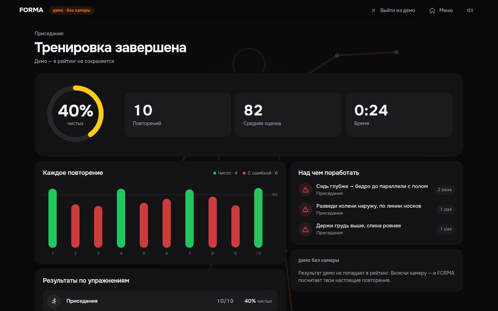
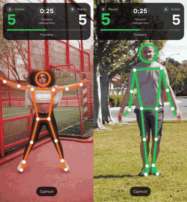

# FORMA — фитнес-тренер через веб-камеру

**Сайт:** https://forma.178.88.115.213.sslip.io/ — ничего не нужно устанавливать.

Тренер в браузере, которым управляют только телом: он считает повторения, замечает ошибки техники и сразу
говорит, как их исправить. Кейс ADMIT Hackathon «Motion: камера вместо джойстика».

<p align="center">
  
</p>
<p align="center"><sub>Чистый повтор — «+100», колено низко — подсказка «Колени выше — до уровня пояса».</sub></p>

## Как запустить локально

Нужен Node.js 22 и браузер с веб-камерой (Chrome, Edge или Safari).

```bash
npm install
npm run dev    # приложение: http://localhost:5173
npm run api    # во втором терминале: аккаунты, рейтинг и онлайн-дуэли
```

- Тренироваться можно и без `npm run api` — не будут работать только аккаунты, рейтинг и дуэли с людьми.
- Камера работает на `localhost` или по HTTPS.
- Без камеры — кнопка «Демо без камеры» на главной.
- `npm test` — тесты.

## Как это работает

1. Открываешь сайт, разрешаешь камеру и отходишь на 2–3 метра.
2. Приложение проверяет, видно ли тебя целиком и хватает ли света, и подсказывает, что поправить.
3. Дальше всё управляется телом:
   - поднятая рука — курсор на экране, задержал его на кнопке — нажатие (на компьютере с мышью — после кнопки
     «Жесты» вверху, на телефоне — всегда);
   - обе руки над головой — «назад» или «закончить подход».
4. Во время подхода поверх видео рисуется твой скелет, идёт счёт и оценка каждого повторения.
5. Если техника неправильная, приложение сразу подсказывает, как исправить: текстом на экране, голосом,
   подсветкой суставов и стрелкой, куда их двигать. Повтор с ошибкой не считается чистым.
6. После подхода — итоги: оценка каждого повторения, число чистых и самые частые ошибки с советом.

Видео с камеры никуда не отправляется — распознавание идёт прямо в браузере.

<p align="center">
  
  
</p>

## Что есть

- **Тренировки:** быстрая тренировка, одно упражнение на выбор, челлендж «60 секунд».
- **Режим «ошибка»:** конкретные подсказки по технике во время движения.
- **Демо без камеры:** можно посмотреть, как всё устроено, не вставая с места.
- **Аккаунты, рейтинг и прогресс:** в рейтинг идут только чистые повторения, есть личные рекорды и график.
- **Дуэли:**
  - онлайн с другом в реальном времени — выбираешь упражнение и время, зовёшь игрока из списка или по ссылке,
    каждое повторение сразу видно сопернику;
  - арена с кубками за победы;
  - бой с ботом.
- **Звук и голос**, работает и на телефоне.

<p align="center">
  
</p>
<p align="center"><sub>Онлайн-дуэль: два человека на разных устройствах, счёт у обоих — в реальном времени.</sub></p>

## Заготовки и сторонние материалы

Весь код написан после старта хакатона (28.09, 07:00), заготовок нет. Сторонние материалы: модель распознавания
позы MediaPipe (Google, Apache 2.0), анатомическая 3D-модель [Z-Anatomy](https://github.com/Z-Anatomy/Models-of-human-anatomy)
(CC BY-SA 4.0, лицензия — `public/models/LICENSE.txt`) и ролики с [Pexels](https://www.pexels.com/license/) в GIF выше.
