# FORMA — AI-тренер через веб-камеру

[](https://github.com/Rauan228/admit-hack/actions/workflows/ci.yml) [](https://abdigaliarslan.github.io/admit-hack/)

Кейс ADMIT Hackathon «Motion: камера вместо джойстика».
FORMA — фитнес-тренер в браузере, которым управляют только телом, включая меню.
Он считает повторения, замечает ошибки техники и говорит, как их исправить.

- **Приложение:** https://forma.178.88.115.213.sslip.io/ (VPS, обновляется через 2 минуты после пуша в `main`)
- **Зеркало:** https://abdigaliarslan.github.io/admit-hack/
- **Стенд движка** (распознавание без UI, открывается и с телефона): https://abdigaliarslan.github.io/admit-hack/dev/engine.html —
  режимы calibration / menu и все 18 упражнений, скелет, курсор, счёт, подсказки, журнал событий.

<p align="center">
  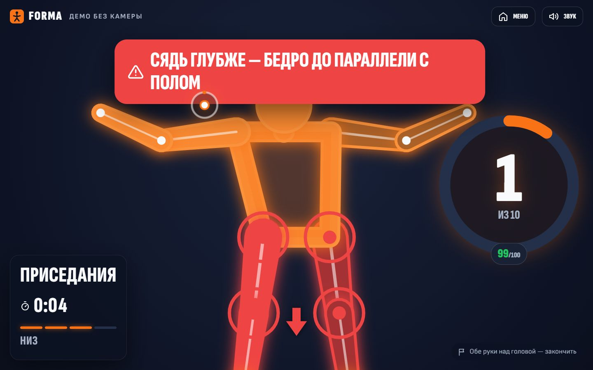
  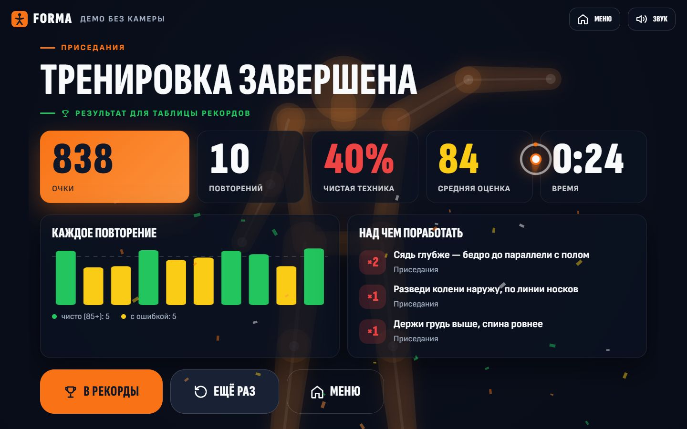
</p>

## Быстрый старт

Нужен Node.js 20+ и браузер с веб-камерой (Chrome, Edge, Safari).

```bash
npm install
npm run dev        # http://localhost:5173 — приложение, /dev/engine.html — стенд движка
npm run api        # API аккаунтов и рейтинга на :8787 (dev-сервер проксирует /api), база — data/forma.db
npm test           # 290+ тестов, в том числе на записанных позах реальных людей
```

Камера работает только на `localhost` или по HTTPS. Без камеры — кнопка «Демо без камеры» на лендинге
(экран-объяснение и тур на 40 секунд) или мок-движок для разработки: `http://localhost:5173/?mock=1`.
Тренироваться можно и без `npm run api` — не будут работать только сохранение, рейтинг и прогресс.

| Команда                                         | Что делает                                          |
| ----------------------------------------------- | --------------------------------------------------- |
| `npm run dev`                                   | dev-сервер                                          |
| `npm run api`                                   | API: аккаунты, результаты, лидерборды (Node 22)     |
| `npm run build`                                 | проверка типов и продакшен-сборка в `dist/`         |
| `npm test`                                      | юнит-, сквозные и тесты на записях (vitest)         |
| `npm run lint` / `npm run format`               | ESLint / Prettier                                   |
| `node scripts/e2e-video.mjs <видео> squat`      | движок в настоящем Chrome на видео вместо камеры    |
| `node scripts/extract-fixtures.mjs <jobs.json>` | видео → записанные позы для тестов                  |
| `node scripts/ui-screens.mjs [--mobile]`        | весь сценарий UI в Chrome + скриншоты экранов       |
| `node scripts/build-ghost.mjs`                  | эталонное движение атлета из записей реальных людей |

## Интерфейс: всё управляется телом

Мышь и клавиатура нужны один раз, чтобы нажать «Начать»: без этого жеста браузер не даст доступ к камере и звуку.
Дальше приложение управляется только телом.

| Жест                     | Что делает                                                                              |
| ------------------------ | --------------------------------------------------------------------------------------- |
| Поднятая рука            | курсор на экране (зона досягаемости вокруг плеча растянута на весь экран)               |
| Курсор над кнопкой 1,2 с | выбор: кнопка заполняется слева направо, кольцо курсора показывает, сколько ещё держать |
| Обе руки над головой     | «назад» в меню и списках, «закончить подход» в приседе и выпадах                        |
| Само упражнение          | счёт, оценка каждого повтора, подсказки техники                                         |

**Сценарий:** лендинг → калибровка («отойди назад», «повернись лицом», «добавь света», переход в меню, когда тебя видно
целиком) → меню → интро упражнения (призрак показывает эталонное движение, отсчёт 3-2-1) → подход → итоги → рекорды.
Программы: быстрая тренировка (присед → «звёздочка» → выпады), одно упражнение на выбор, челлендж «60 секунд —
максимум чистых приседаний».

**Режим «ошибка» в интерфейсе.** Каждая подсказка движка показывается четырьмя способами одновременно:

1. **Текст**: крупная плашка сверху. Красная для серьёзной ошибки, жёлтая для замечания.
2. **Голос**: Web Speech API, ru-RU. Подсказка перебивает счёт, счёт никогда не перебивает подсказку.
3. **Суставы**: проблемные суставы на скелете пульсируют красным.
4. **Стрелка**: у сустава рисуется стрелка, куда его двигать (вниз, вверх, колени наружу).

Чистое повторение даёт зелёную вспышку скелета, звук и «Отлично!». В итогах видны оценка каждого повтора и топ-3 ошибки
с тем же советом.

**Эталон движения — анатомический 3D-атлет.** Перед подходом, в выборе упражнения и на лендинге показана
анатомическая модель человека (мышцы и видимые кости) на three.js, и красным — какие мышцы работают в этом
упражнении (присед — квадрицепсы, ягодичные, приводящие; выпады — квадрицепсы, ягодичные, бицепс бедра, икры;
«звёздочка» — дельты, отводящие бедра, икры; подъём рук — дельты, трапеции). Яркость мышцы — по нагрузке из позы
(глубже присед — ярче квадрицепсы).

- Модель — [Z-Anatomy](https://github.com/Z-Anatomy/Models-of-human-anatomy) (CC BY-SA 4.0, на основе
  BodyParts3D, CC BY-SA 2.1 JP). `scripts/blender/prep-zanatomy.py` (Blender без интерфейса) оставляет мышцы и видимые
  кости, убирает фасции и сухожилия, упрощает сетку (полная — 170 тыс. треугольников, для телефона — 67 тыс.),
  собирает подсвечиваемые группы по сторонам и считает суставы по костям. Производная модель — под CC BY-SA 4.0
  (`public/models/LICENSE.txt`).
- Скелета в модели нет — веса вершин считаются в браузере по расстоянию до сегментов костей, а кости каждый кадр
  ставятся по 3D-точкам движения (поворот + растяжение под длину сегмента): `src/ui/three/zanatomy.ts`.
- Движение: присед — настоящий повтор человека из записи (3D-точки MediaPipe), «звёздочка», выпады (руки на поясе,
  правая + левая нога) и подъём рук — кинематика на его пропорциях (`scripts/build-ghost.mjs`).
- Один общий WebGL-рендерер на все атлеты страницы, рисуются только видимые, ≤ 30 кадров/с; three.js и модель
  грузятся лениво.

**Бонусы:** рекорды (топ-10) и общий прогресс в localStorage, ник выбирается жестом из сгенерированных. Звуки синтезируются
WebAudio, без файлов. Есть конфетти на рекорд и вибрация на телефоне. Вертикальная раскладка для телефона, фронтальная камера,
подсказка «поставь телефон у стены». Если человек вышел из кадра, включается пауза. Загрузка модели показана по шагам,
ошибки камеры объясняются понятным текстом. Анимации уважают `prefers-reduced-motion`.

Дизайн: тёмная тема, энергичный оранжевый и зелёный для успеха (подобрано под фитнес-приложение по базе
ui-ux-pro-max), шрифты Sofia Sans Extra Condensed и Sofia Sans с кириллицей, SVG-иконки. Всё читается с 2–3 метров.

| Лендинг                                 | Калибровка                                     | Меню                                        |
| --------------------------------------- | ---------------------------------------------- | ------------------------------------------- |
| 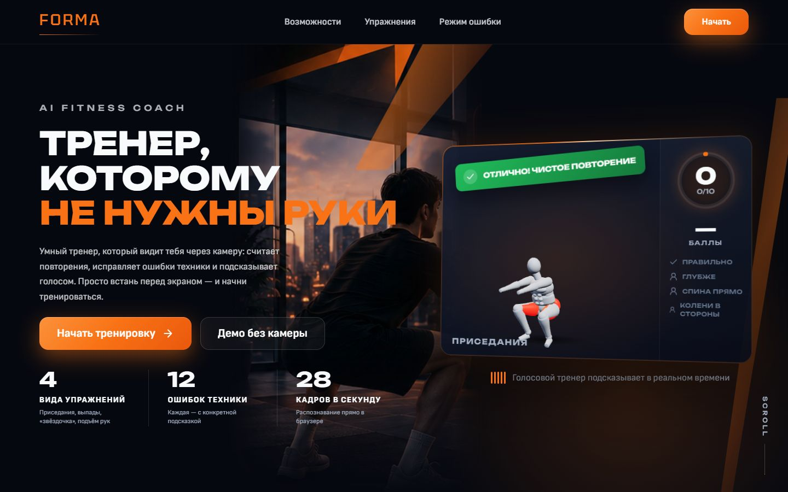 | 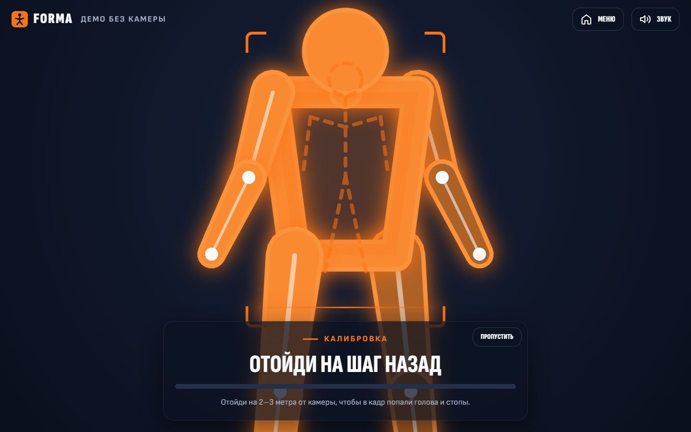 | 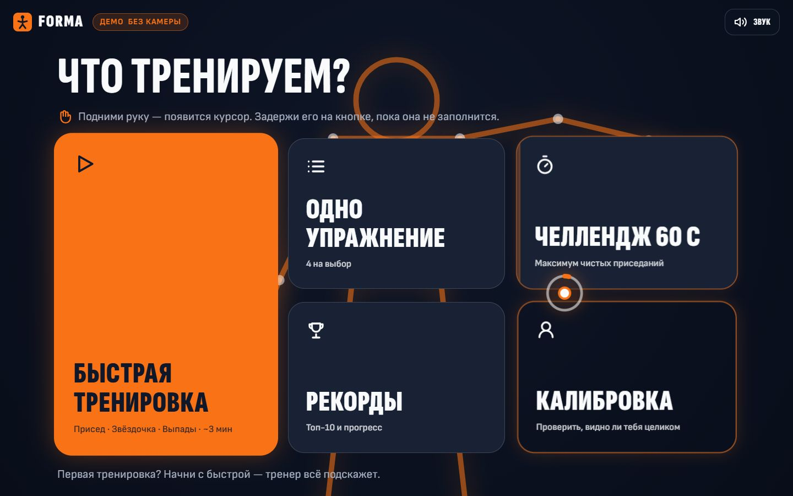           |
| **Выбор упражнения**                    | **Интро с призраком**                          | **Рекорды**                                 |
| 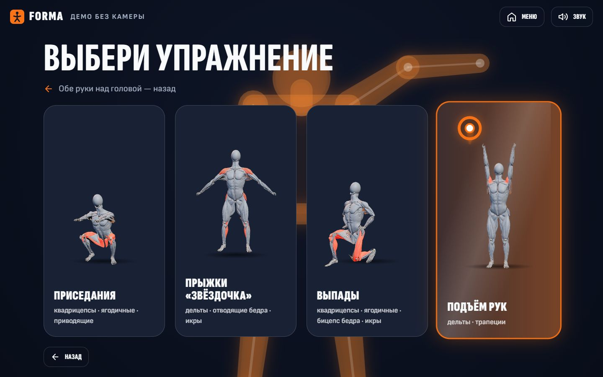    | 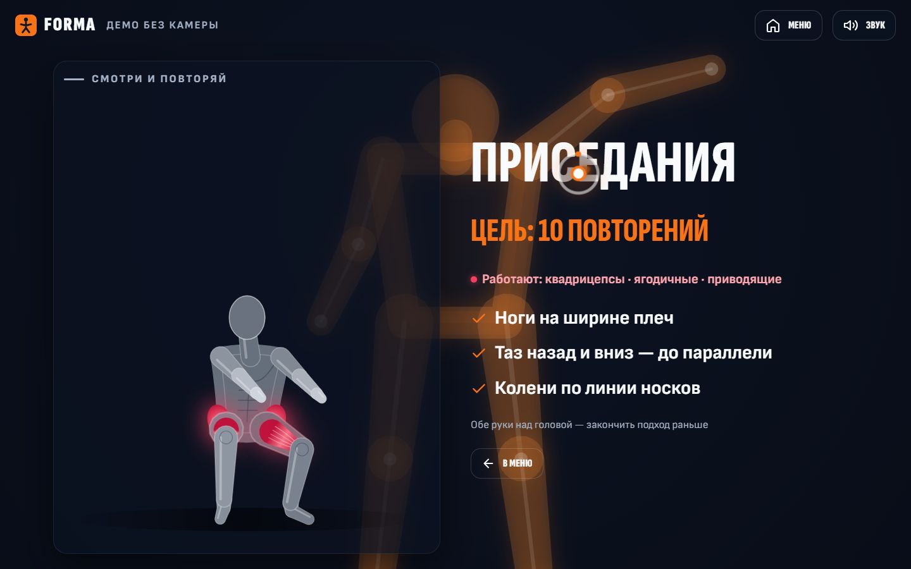            | 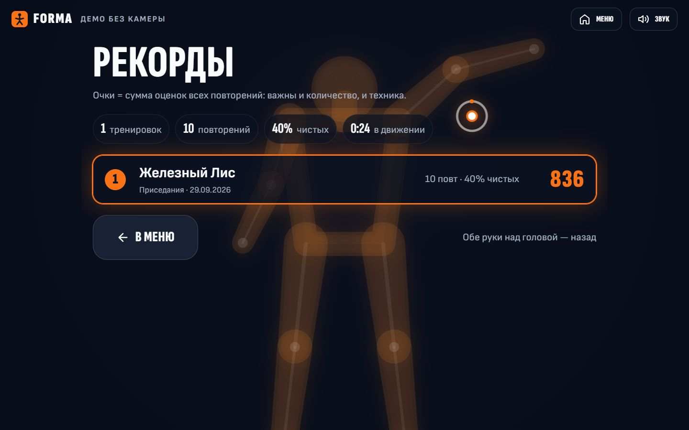 |

<p align="center">
  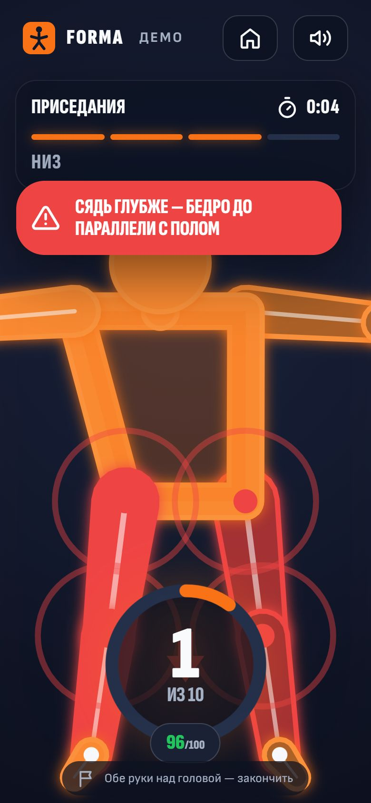
  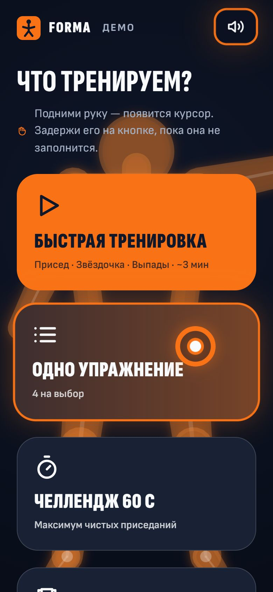
  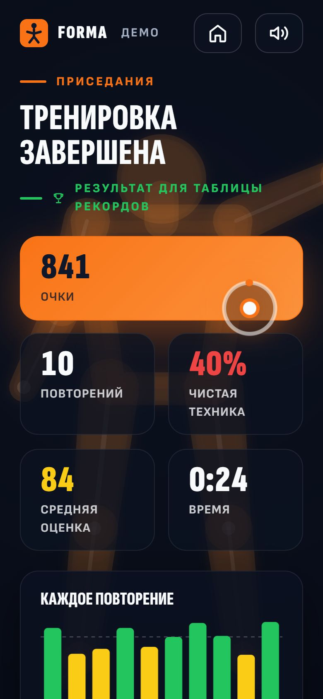
</p>

Код UI: `src/ui/` — `App.tsx` (экраны как машина состояний), `screens/` (экраны), `components/` (сцена со скелетом,
курсор и выбор удержанием, «призрак», график), `audio/` (голос и звуки), `store/` (рекорды), `engine/bus.ts`
(единственная точка связи с движком). Флаги URL: `?mock=1` — демо без камеры, `?nodwell` — курсор не нажимает кнопки
(для записи демо мышью).

## Аккаунты, рейтинг и прогресс

Тренировку можно начать сразу, без регистрации. На итогах — кнопка «Сохранить». Гость попадает на экран
входа или регистрации (почта, пароль и ник для рейтинга), после входа результат сохраняется сам, а на итогах
видно место в рейтинге, личный рекорд и прирост к прошлому разу. Результаты демо без камеры не сохраняются.

**Рейтинг считает сервер** по формулам из `src/shared/rating.ts`: тот же файл импортирует и UI, поэтому на
итогах видно то же число. Во всех режимах в рейтинг идут только **чистые** повторения, то есть без ошибок
техники. Так соревнование продолжает режим «ошибка»: халтура не приносит очков.

| Доска                                             | Рейтинг                                                                                                  | При равенстве       |
| ------------------------------------------------- | -------------------------------------------------------------------------------------------------------- | ------------------- |
| Быстрая тренировка                                | чистые повторения × средняя оценка ÷ 10 + бонус за темп (до 40, только за весь план)                     | выше % чистых       |
| Одно упражнение (своя доска на каждое упражнение) | индекс техники из 100: 60% — средняя оценка, 40% — доля чистых повторений от цели (бросил подход — ниже) | быстрее             |
| Челлендж 60 с                                     | число чистых приседаний за минуту                                                                        | выше средняя оценка |

- **Лидерборд:** три режима, для «Одного упражнения» можно выбрать упражнение, периоды «сегодня» (по
  Астане) / «неделя» / «всё время». В таблице лучший результат каждого игрока, своя строка подсвечена и
  видна, даже если ты за пределами топа.
- **Мой прогресс:** по каждой доске — рекорд, последний результат, прирост и график последних 20 попыток.
  Отсюда же кнопка «Побить рекорд».
- **Защита от накруток:** сервер сам пересчитывает рейтинг и отклоняет неправдоподобные результаты, например
  больше ~1,5 повторения в секунду, чистых больше, чем всего, или челлендж дольше минуты. Кроме того, есть
  лимит попыток входа и сохранения.
- **API без зависимостей** (`server/`): `node:http`, встроенный `node:sqlite`, пароли через `scrypt`. Сессия
  хранится в HttpOnly-cookie, в базе лежит только SHA-256 токена. Эндпоинты: `POST /api/register`, `/login`,
  `/logout`, `/results`; `GET /api/me`, `/leaderboard?board=&period=`, `/me/progress`. Тесты:
  `tests/server.test.ts`.

## Как это работает

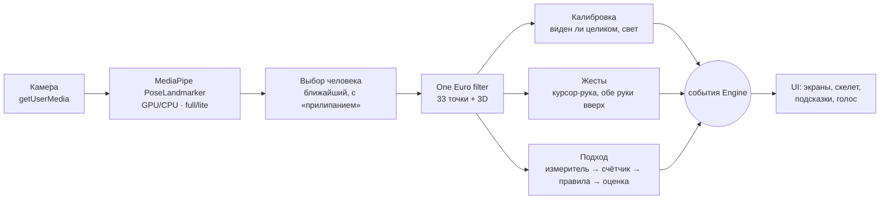

Весь движок — чистый TypeScript без React (`src/engine/`). UI только подписывается на события контракта
`src/engine/types.ts` и рисует их; в UI нет ни одной строчки логики распознавания.

1. **Поза.** MediaPipe Tasks Vision PoseLandmarker, модель грузится с CDN. GPU — только на аппаратном WebGL:
   программный WebGL (SwiftShader) формально «GPU», но медленнее CPU в 12 раз (замер: 630 против 52 мс на кадр),
   поэтому ловим его заранее. На телефоне и без GPU — лёгкая модель.
2. **Сглаживание.** One Euro filter: неподвижная точка не дрожит (шум гасится в 3,4 раза), быстрое движение почти без
   задержки (≈ 1 % кадра). Скорость нормирована на длину корпуса — поведение не зависит от расстояния до камеры.
3. **Геометрия с поправкой на аспект.** MediaPipe отдаёт x в долях ширины, а y — в долях высоты; без поправки углы в кадре
   16:9 врут на десятки градусов.
4. **Подход:** измеритель упражнения превращает позу в «прогресс» (0 — исходное положение, 1 — полная амплитуда),
   общий конечный автомат считает повторы, движок правил ловит ошибки, оценка складывается из штрафов.

### Почему не угол колена

План предлагал считать присед по углу колена (> 160° стоя → < 100° внизу). **Анфас это не работает:** пользователь стоит
лицом к камере (иначе не будет меню жестами), бедро в приседе уходит на камеру, и угол колена в проекции почти не меняется.
Что видно с любого ракурса — **высота таза относительно колена**: «бедро параллельно полу» ровно «таз на уровне колена».
Глубина = (вертикаль бедра / вертикаль голени) относительно того же отношения стоя: 1 стоя, 0 на параллели. Деление на голень
делает меру независимой от расстояния до камеры (первая версия без него «приседала», когда человек отходил, — поймал тест).

## Режим «ошибка» (твист)

- **Правила привязаны к фазе.** Глубину судим по итогу повтора (самая глубокая точка), наклон корпуса — на всём пути вниз
  и вверх, колени — пока они реально согнуты.
- **Антидребезг по времени, а не по кадрам:** нарушение должно продержаться 200 мс и 3 кадра — одинаково на 15 и 30 FPS.
- **Одна подсказка за раз, самая важная** (у каждой ошибки приоритет). Та же фраза — не чаще раза в 4 с, между разными —
  не меньше 1,5 с, чтобы голос не перебивал сам себя; более важная ошибка перебивает паузу.
- **Мультимодально:** текст, голос, красные суставы (`joints`) и стрелка (`arrow`) — у каждой ошибки свои.
  Суставы и стрелка уточняются по факту: завалилось левое колено — красное левое; таз уехал вправо — стрелка влево.
- **Оценка повтора** = 100 − штрафы его ошибок (не ниже 10). Итоги подхода: чистые повторы, средняя, частые ошибки.
- **«Движение не распознано» не бывает:** неглубокая попытка не засчитывается, но на неё приходит «Сядь глубже».
- **Правило — одна запись:** код подсказки из каталога `src/engine/hints.ts` + проверка. Текст, суставы, фазы, важность и
  штраф — в каталоге; все пороги — в одном конфиге `src/engine/config.ts`.

| Упражнение                | Ошибка                                                               | Как меряем                                                                        | Подсказка                                                                                        |
| ------------------------- | -------------------------------------------------------------------- | --------------------------------------------------------------------------------- | ------------------------------------------------------------------------------------------------ |
| Приседания                | мало глубины                                                         | прогресс в нижней точке < 0,95 (бедро не дошло до параллели)                      | «Сядь глубже — бедро до параллели с полом»                                                       |
|                           | колени внутрь                                                        | колено внутри линии таз → щиколотка на 0,35 ширины таза, или колени уже щиколоток | «Разведи колени наружу, по линии носков»                                                         |
|                           | наклон корпуса                                                       | угол корпуса от вертикали по 3D-точкам > 45°                                      | «Держи грудь выше, спина ровнее»                                                                 |
|                           | асимметрия                                                           | разная глубина ног, смещение или перекос таза                                     | «Распредели вес на обе ноги»                                                                     |
|                           | слишком быстро                                                       | повтор короче 0,75 с                                                              | «Медленнее — опускайся за 2 секунды»                                                             |
| «Звёздочка»               | руки низко                                                           | нижняя рука не поднялась выше головы                                              | «Подними руки выше головы»                                                                       |
|                           | ноги узко                                                            | стопы не разошлись шире 1,1 ширины плеч                                           | «Шире ноги — шире плеч»                                                                          |
|                           | не синхронно                                                         | руки и ноги проходят середину амплитуды с разницей > 250 мс                       | «Руки и ноги — одновременно»                                                                     |
| Выпады                    | колено за носком                                                     | колено передней ноги впереди носка > 10 см (3D, вдоль стопы пятка → носок)        | «Колено не дальше носка — шаг длиннее»                                                           |
|                           | заднее колено высоко                                                 | заднее колено не опустилось к полу                                                | «Опусти заднее колено ближе к полу»                                                              |
|                           | наклон корпуса                                                       | угол корпуса по 3D > 25°                                                          | «Корпус вертикально»                                                                             |
| Подъём рук                | руки согнуты                                                         | угол в локте в верхней точке < 150° (3D)                                          | «Выпрями руки полностью»                                                                         |
|                           | одна рука ниже                                                       | высоты рук различаются больше чем на 0,3 амплитуды                                | «Поднимай руки одновременно»                                                                     |
| Высокие колени            | колени низко                                                         | подъём колена (вертикаль таз → колено к корпусу стоя) < 0,55                      | «Колени выше — до уровня пояса»                                                                  |
|                           | отклон назад                                                         | корпус отклонён назад по 3D > 25°                                                 | «Не отклоняйся назад — держи корпус прямо»                                                       |
| Локоть к колену           | локоть не дотянулся                                                  | локоть и противоположное колено не сошлись до ~0,5 корпуса                        | «Тянись локтем к противоположному колену — до касания»                                           |
|                           | колено низко                                                         | колено поднялось меньше ~45°                                                      | «Подними колено выше — навстречу локтю»                                                          |
| Присед + руки вверх       | мало глубины                                                         | глубина приседа (как у приседа) < 0,9                                             | «Сядь глубже — бедро до параллели с полом»                                                       |
|                           | жим не до конца                                                      | руки не выше головы или самый прямой локоть наверху < 145°                        | «Выпрями руки над головой до конца»                                                              |
|                           | колени внутрь                                                        | как у приседа                                                                     | «Разведи колени наружу, по линии носков»                                                         |
| Наклоны в стороны         | мало наклона                                                         | наклон корпуса вбок в кадре < ~22°                                                | «Наклонись ниже — тянись рукой к колену»                                                         |
|                           | наклон вперёд                                                        | наклон вперёд по 3D > 25°                                                         | «Наклоняйся строго в сторону — не вперёд»                                                        |
|                           | таз уехал                                                            | таз сместился над стопами в сторону наклона > 0,5 ширины таза                     | «Таз на месте — наклоняется только корпус»                                                       |
| Отведение ноги            | нога низко                                                           | угол ноги к оси корпуса < ~37°                                                    | «Отведи ногу выше в сторону»                                                                     |
|                           | корпус заваливается                                                  | наклон корпуса вбок > 15°                                                         | «Не наклоняй корпус — в сторону уходит только нога»                                              |
|                           | колено согнуто                                                       | угол в колене в кадре < 155°                                                      | «Нога прямая — не сгибай колено»                                                                 |
| Боковые выпады            | мало глубины                                                         | сгиб колена меньше ~80° (вертикаль бедра к голени)                                | «Опустись ниже — бедро согнутой ноги к параллели»                                                  |
|                           | вторая нога согнута                                                  | угол в колене прямой ноги < 155°                                                  | «Выпрями вторую ногу»                                                                            |
|                           | колено внутрь                                                        | колено внутри линии таз → щиколотка > 0,35 ширины таза                            | «Колено по линии носка — не заваливай внутрь»                                                    |
|                           | наклон корпуса                                                       | наклон по 3D > 45°                                                                | «Держи грудь выше, спина ровнее»                                                                 |
| Присед с выпрыгиванием    | мало глубины                                                         | глубина перед прыжком < 0,8                                                       | «Сядь глубже перед прыжком — бедро к параллели»                                                  |
|                           | нет прыжка                                                           | щиколотки не оторвались от пола на ~6 см                                          | «Выпрыгни вверх — стопы отрываются от пола»                                                      |
|                           | колени внутрь                                                        | как у приседа                                                                     | «Разведи колени наружу, по линии носков»                                                         |
| Подъём на носки           | низко                                                                | пятки и щиколотки над носками поднялись < ~5 см (относительно носков, не пола)    | «Поднимись выше — на самые носки»                                                                |
|                           | быстро                                                               | повтор короче 0,9 с                                                               | «Медленнее — задержись наверху на секунду»                                                       |
| «Звёздочка» с перекрёстом | нет перекрёста                                                       | кисти не сошлись перед грудью                                                     | «Скрести руки перед грудью»                                                                      |
|                           | ноги узко                                                            | стопы не шире 1,1 ширины плеч                                                     | «Шире ноги в прыжке — шире плеч»                                                                 |
|                           | руки низко                                                           | в раскрытом положении кисти ниже плеч > 0,35 корпуса                              | «Руки в стороны на уровне плеч»                                                                  |
| Круги руками              | руки опущены                                                         | центр кругов ниже плеч > 0,35 корпуса                                             | «Держи руки на уровне плеч»                                                                      |
|                           | локти согнуты                                                        | угол в локте в кадре < 150°                                                       | «Руки прямые — крути от плеча»                                                                   |
|                           | маленькие круги                                                      | радиус круга кисти < 0,12 корпуса                                                 | «Круги шире — рисуй кистью большой круг»                                                         |
| Бокс (джеб, кросс)        | удар не в полную длину                                               | вынос кисти к камере по 3D < ~0,9 корпуса                                         | «Выпрямляй руку до конца — удар в полную длину»                                                  |
|                           | опущена защита                                                       | вторая кисть ниже плеча во время удара                                            | «Держи вторую руку у подбородка»                                                                 |
| Отжимания (боком)         | неглубоко                                                            | угол в локте внизу > ~100°                                                        | «Опускайся ниже — локти до 90°»                                                                  |
|                           | таз провис / домиком                                                 | таз ниже / выше линии плечи → щиколотки > 6 / 8 % её длины                        | «Не проваливай таз» / «Опусти таз — тело в одну линию»                                           |
| Планка (на время)         | таз провис / домиком                                                 | то же, каждую секунду удержания                                                   | «Не проваливай таз» / «Опусти таз — тело в одну линию»                                           |
| Бёрпи                     | не до упора лёжа                                                     | плечи опустились меньше, чем до ~0,4 высоты стоя                                  | «Опустись до упора лёжа — руки на полу, ноги назад»                                              |
|                           | нет прыжка                                                           | после подъёма стопы не оторвались и руки не над головой                           | «В конце выпрыгни вверх — руки над головой»                                                      |
| Калибровка                | нет человека / не целиком / близко / далеко / темно / боком / у края | видимость ключевых точек, рост в кадре, яркость кадра, ширина плеч к корпусу      | «Отойди на шаг назад — нужно видеть ноги», «Повернись лицом к камере», «Встань в центр кадра», … |

Пороги подобраны на реальных записях — на всех записях с хорошей техникой ноль ложных ошибок. Что показали данные
и почему пороги такие — в заметках команды и в комментариях `src/engine/config.ts`.

## Надёжность

- **Счёт без двойных срабатываний:** гистерезис порогов; «отскок» внизу — тот же повтор; сбой детектора короче 0,25 с —
  не повтор; повтор закрывается, только когда человек действительно вернулся в исходное положение.
- **Фильтр правдоподобия:** кадр, где скелет «телепортировался», не считается (фаззинг случайными кадрами — 0 ложных повторов).
- **Двое в кадре:** MediaPipe отслеживает одного человека и держится за него (детектор не перезапускается, пока
  его видно) — прохожий за спиной не перехватит счёт; при нескольких кандидатах `person.ts` берёт ближайшего.
- **Человек ушёл из кадра** — пауза и «Вернись в кадр»; стемнело — «Слишком темно»; вернулся — счёт продолжается.
- **Слабое устройство:** на телефоне лёгкая модель и камера 480×360; если детекция в среднем медленнее 45 мс — движок сам
  переходит на лёгкую модель, не останавливая камеру; ещё медленнее — ограничивает обработку 15 FPS, чтобы UI не дёргался.
- Ошибка камеры приходит понятным текстом (`CameraError`: нет доступа, занята, не найдена, нужен HTTPS).

## Тесты и проверка на реальных людях

```bash
npm test
```

- **Записанные позы** — 7 роликов с Wikimedia Commons, прогнанных через тот же MediaPipe (`tests/fixtures/`, авторы и
  лицензии — в README там же). Счёт размечен **вручную по раскадровке**, независимо от алгоритма.
  `tests/fixtures.test.ts` проверяет каждую запись на 30 и на 15 FPS:

  | Запись                              | Ракурс                                     | Повторы (размечено) | Движок                    |
  | ----------------------------------- | ------------------------------------------ | ------------------- | ------------------------- |
  | Присед с гирей                      | анфас, человек мелко, сзади второй человек | 2                   | 2, без ошибок             |
  | Присед со штангой                   | со спины                                   | 2                   | 2, без ошибок             |
  | Присед с гирей                      | сбоку                                      | 6                   | 6, без ошибок             |
  | Присед против света                 | сбоку, силуэт                              | 6                   | 6, без ошибок             |
  | «Звёздочка» + бёрпи между подходами | анфас                                      | 6 (бёрпи — 0)       | 6, без ошибок             |
  | Выпады с удержанием 11–13 с         | анфас                                      | 2                   | 2, без ошибок             |
  | Обратные выпады против света        | анфас, силуэт                              | 5                   | 5 ± 1 (левая нога в тени) |

- **Синтетика** (`src/engine/skeleton.ts`): человек анфас с честной кинематикой + шум модели. Каждая ошибка воспроизводится
  и проверяется со своей подсказкой, суставами и стрелкой; «10 приседаний = 10» на 30 и 15 FPS, с шумом, быстро и с паузой.
- **Сквозные** (`tests/engine.test.ts`): реальный движок с фейковой камерой проходит калибровку, меню, подход, паузу,
  переход на лёгкую модель.
- **Настоящий браузер на видео вместо камеры** (`scripts/e2e-video.mjs`: Chrome + MediaPipe + движок, в том числе на боевом
  сайте): присед 2/2, «звёздочка» 6/6, выпады 2/2, 26–28 FPS на CPU.

CI (GitHub Actions): проверка типов, линтер, тесты, сборка — на каждый push и PR.

## Деплой (HTTPS)

Камера в браузере работает только по HTTPS. Основной адрес — https://forma.178.88.115.213.sslip.io/
(VPS, nginx + Let's Encrypt): раз в 2 минуты сервер подтягивает `main`, собирает фронтенд и перезапускает API
(`forma-api`, systemd, `node --experimental-strip-types server/index.ts`, nginx проксирует `/api/`). Зеркала
без API, где тренировки работают, а рейтинг покажет «сервер недоступен»:

- **GitHub Pages (работает сейчас):** форк [abdigaliarslan/admit-hack](https://github.com/abdigaliarslan/admit-hack)
  раз в 15 минут сам подтягивает `main` этого репозитория, прогоняет тесты и выкладывает сборку
  (`.github/workflows/pages.yml`). Приложение: https://abdigaliarslan.github.io/admit-hack/ ,
  стенд движка: https://abdigaliarslan.github.io/admit-hack/dev/engine.html (можно открыть с телефона).
- **Vercel:** импортировать репозиторий на vercel.com — настройки уже в `vercel.json` (сборка, заголовки
  `Permissions-Policy: camera=(self)`, кэш ассетов). Автодеплой из `main` включается сам.

**Выпады считаются парой ног.** Правая нога вперёд, затем левая — это 1 повтор. Каждая сторона — событие
`half_rep` (с ошибками этой половины), `rep` приходит, когда сделаны обе; та же нога дважды подряд — подсказка
«Теперь шагни левой (правой) ногой». Распознавание одиночного выпада не менялось: тесты на записях людей
сверяют каждое движение по `half_rep`, а `tests/lunge-pairs.test.ts` проверяет пары.

## Контракт движок ↔ UI

```
src/
  engine/     распознавание (без React)
    types.ts  контракт движок ↔ UI
  mocks/      мок-движок для разработки UI без камеры
  ui/         экраны, компоненты, звук, голос, рекорды (React)
tests/        тесты, записанные позы, помощники
```

### Как подключить движок в UI

Движок берётся только через фабрику: она сама решает, отдать мок или реальный движок.

```ts
import { createEngine } from '../engine/createEngine';

const engine = await createEngine(); // ?mock=1 в адресе → мок-движок
const off = engine.on((e) => {
  // e: EngineEvent из контракта
  if (e.type === 'rep') setCount(e.count);
});
await engine.start(videoEl); // CameraError с текстом на русском, если камеры нет
engine.setMode({ exercise: 'squat', targetReps: 10 });
// при размонтировании
off();
engine.stop();
```

Порядок событий на подходе: `phase` → `form_error` → `form_ok` (чистый повтор) → `rep` → … → `set_complete`.
Калибровка в режиме `calibration` приходит при смене статуса и раз в секунду; в меню и на подходе — только когда человек
пропал (`no_person`/`partial`/`dark`) и когда вернулся (`ok`). «Призрак» для интро упражнения:
`ghostPoseAt(exercise, tMs, aspect)` из `src/engine/ghostPoses.ts` — точки в формате `frame`.

Договорённости, которых нет в типах: `pointer.x/y` — **доли экрана 0..1, уже зеркально**: зона досягаемости вокруг плеча
поднятой руки растянута на весь экран; `frame.landmarks` — нормализованные координаты MediaPipe (UI отражает сам, как видео).

### Мок-движок (разработка UI без камеры)

`src/mocks/mockEngine.ts` реализует тот же интерфейс `Engine` и по таймеру шлёт все события контракта.

- `engine.start(video)` без последующего `setMode` запускает **полный автосценарий по кругу**:
  калибровка (`partial` → `too_close` → `ok`) → меню (курсор ходит, теряется, `both_hands_up`) →
  сет из 5 повторений (фазы, `rep` с оценкой, `form_error`, `form_ok`) → `set_complete`,
  затем следующее упражнение: приседания → звёздочка → выпады → подъём рук.
- Как только UI вызвал `setMode`, автосценарий отключается и мок играет только заданный режим.
- `frame` содержит 33 точки MediaPipe (синтетический скелет), поэтому `SkeletonCanvas`
  и подсветка суставов отлаживаются без камеры.

```ts
import { createMockEngine } from '../mocks/mockEngine';

const engine = createMockEngine({ speed: 2, autoRun: false, seed: 42 });
```

| Опция     | По умолчанию | Что делает                                   |
| --------- | ------------ | -------------------------------------------- |
| `fps`     | `30`         | частота событий `frame`                      |
| `speed`   | `1`          | ускорение сценария                           |
| `autoRun` | `true`       | играть автосценарий, если `setMode` не звали |
| `seed`    | фиксирован   | воспроизводимые оценки повторений            |

## Код движка

| Файл                                                  | Что внутри                                                                                                      |
| ----------------------------------------------------- | --------------------------------------------------------------------------------------------------------------- |
| `engine/Engine.ts`                                    | реальный движок: цикл, режимы, события                                                                          |
| `engine/session.ts`                                   | подход: счётчик → правила → оценка → события                                                                    |
| `engine/exercises/`                                   | `squat`, `jumpingJack`, `lunge`, `armRaise` (измерители и правила), `fsm` (счётчик), `baseline` (эталон «стоя») |
| `engine/rules.ts`                                     | движок правил: антидребезг, фазы, приоритет, кулдаун                                                            |
| `engine/scoring.ts`                                   | оценка повтора и итоги подхода                                                                                  |
| `engine/calibration.ts`, `brightness.ts`              | калибровка и свет                                                                                               |
| `engine/gestures.ts`                                  | курсор-рука, «обе руки вверх»                                                                                   |
| `engine/filter.ts`, `geometry.ts`                     | One Euro, углы, расстояния с поправкой на аспект                                                                |
| `engine/pose.ts`, `camera.ts`, `person.ts`, `perf.ts` | MediaPipe, камера, выбор человека и правдоподобие, адаптация под устройство                                     |
| `engine/ghostPoses.ts`, `skeleton.ts`                 | «призрак» и кинематический скелет                                                                               |
| `engine/hints.ts`, `config.ts`                        | все тексты подсказок и все пороги                                                                               |

## Стек

Vite · React · TypeScript · MediaPipe Tasks Vision (PoseLandmarker) · Vitest · ESLint · Prettier · Playwright (проверки в браузере)

## Заготовки

Весь код написан после старта хакатона (28.09, 07:00), заранее подготовленных заготовок нет.
Сторонние части: библиотека и модель MediaPipe Pose (Google, Apache 2.0) и ролики с Wikimedia Commons для тестов
(в репозитории — только извлечённые координаты точек, авторы и лицензии в `tests/fixtures/README.md`).
